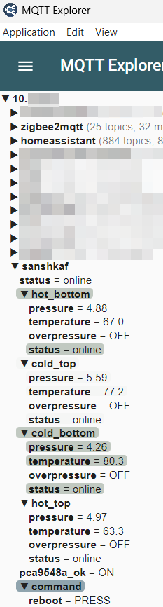
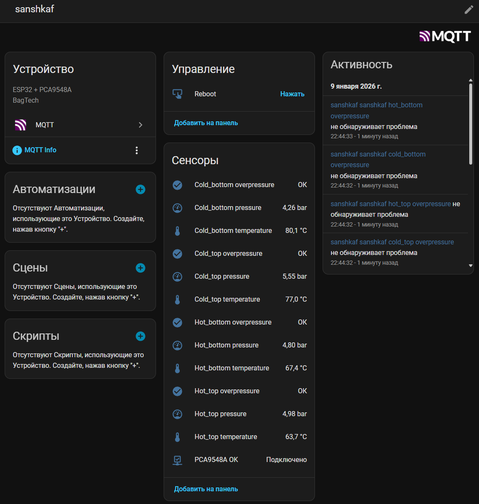
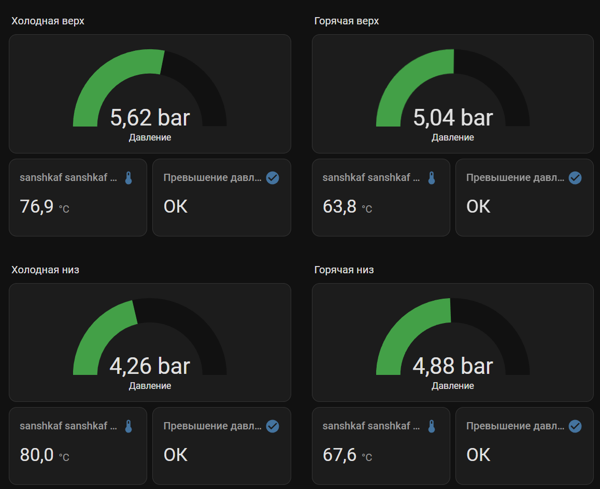

# ESP32 + PCA9548A + MQTT + Home Assistant AutoDiscovery

Полнофункциональный боевой скетч для работы с несколькими датчиками давления через PCA9548A с интеграцией в Home Assistant через MQTT.

## 📋 Описание

Этот пример демонстрирует полную интеграцию системы мониторинга давления в Home Assistant:

- **4 датчика давления** через PCA9548A мультиплексор
- **MQTT** для связи с Home Assistant
- **AutoDiscovery** — автоматическое добавление всех сущностей в Home Assistant
- **Availability tracking** — отслеживание состояния каждого датчика
- **Overpressure detection** — обнаружение перегрузки с гистерезисом
- **OTA обновления** — обновление прошивки по воздуху
- **Reboot button** — кнопка перезагрузки из Home Assistant

## 🔧 Функциональность

### MQTT топики

#### Устройство (Device)
- `sanshkaf/status` — LWT (Last Will and Testament) устройства: `online`/`offline`
- `sanshkaf/pca9548a_ok` — состояние PCA9548A: `ON`/`OFF` (retained)

#### Датчики (по каждому датчику)
- `sanshkaf/<name>/status` — статус датчика: `online`/`offline` (retained)
- `sanshkaf/<name>/pressure` — давление в барах (2 знака после запятой, retained)
- `sanshkaf/<name>/temperature` — температура в °C (1 знак после запятой, retained)
- `sanshkaf/<name>/overpressure` — перегрузка: `ON`/`OFF` (retained)

#### Команды
- `sanshkaf/command/reboot` — команда перезагрузки (payload: `PRESS`)

### Availability (доступность сущностей)

Каждая сущность (pressure, temperature, overpressure) имеет трёхуровневую систему availability:

1. **Устройство онлайн** — `sanshkaf/status` = `online`
2. **PCA9548A работает** — `sanshkaf/pca9548a_ok` = `ON`
3. **Датчик онлайн** — `sanshkaf/<name>/status` = `online`

Сущность доступна только если **все три условия** выполнены (`availability_mode: all`).

### Home Assistant AutoDiscovery

При подключении к MQTT брокеру скетч автоматически публикует конфигурации для Home Assistant:

- **Binary Sensor**: PCA9548A OK (device_class: connectivity)
- **Sensor**: Давление для каждого датчика (device_class: pressure, unit: bar)
- **Sensor**: Температура для каждого датчика (device_class: temperature, unit: °C)
- **Binary Sensor**: Перегрузка для каждого датчика (device_class: problem)
- **Button**: Перезагрузка устройства

Все сущности автоматически появляются в Home Assistant как одно устройство.

### Обнаружение перегрузки

Система отслеживает превышение давления с гистерезисом:

- **Включение**: давление ≥ 8.0 bar
- **Выключение**: давление ≤ 7.6 bar

Это предотвращает "дребезг" при значениях около порога.

### Настройка датчиков

В массиве `SENSORS` настраиваются датчики:

```cpp
static const SensorDef SENSORS[] = {
  {1, "cold_top",    3},  // канал PCA, имя, количество попыток чтения
  {2, "cold_bottom", 3},
  {3, "hot_top",     6},
  {4, "hot_bottom",  6},
};
```

## ⚙️ Конфигурация

### Wi-Fi

```cpp
static const char* WIFI_SSID = "MyWiFi";
static const char* WIFI_PASS = "pass_from_MyWiFi";
```

### MQTT

```cpp
static const char* MQTT_HOST = "10.0.0.10";
static const uint16_t MQTT_PORT = 1883;
static const char* MQTT_USER = "sanshkaf";
static const char* MQTT_PASS = "sanshkafsanshkaf";
```

### Идентификаторы

```cpp
static const char* NODE_ID  = "sanshkaf";        // ID устройства в MQTT
static const char* HOSTNAME = "esp32-sanshkaf";  // Hostname для OTA и mDNS
```

### OTA

```cpp
static const char* OTA_PASS = "123456";  // Пароль для OTA обновлений
```

### Тайминги

```cpp
static const uint32_t SAMPLE_PERIOD_MS = 250;  // Период опроса (4 Hz)
static const uint32_t SENSOR_OFFLINE_MS = 5000;  // Таймаут offline датчика
static const uint32_t PCA_CHECK_MS = 2000;  // Период проверки PCA9548A
```

### Пороги перегрузки

```cpp
static const float OVERP_ON_BAR  = 8.0f;   // Включение перегрузки
static const float OVERP_OFF_BAR = 7.6f;   // Выключение перегрузки
```

## 📦 Зависимости

Установите через Arduino Library Manager:

- **WiFi** (встроенная в ESP32)
- **PubSubClient** — MQTT клиент
- **ArduinoOTA** — OTA обновления
- **ESPmDNS** — mDNS для OTA

## 🚀 Использование

1. **Настройте конфигурацию** в начале файла (WiFi, MQTT, датчики)

2. **Загрузите скетч** в ESP32

3. **Проверьте подключение**:
   - ESP32 должен подключиться к WiFi
   - Подключиться к MQTT брокеру
   - Опубликовать AutoDiscovery конфигурации

4. **В Home Assistant**:
   - Перейдите в **Настройки → Устройства и службы**
   - Найдите устройство `sanshkaf`
   - Все сущности должны появиться автоматически

5. **OTA обновления**:
   - В Arduino IDE: **Инструменты → Порт** → выберите `esp32-sanshkaf.local`
   - Или используйте IP адрес ESP32

## 📊 Скриншоты

### MQTT Explorer



Показывает структуру MQTT топиков и значения.

### Устройство в Home Assistant



Все сущности автоматически добавлены через AutoDiscovery.

### UI в Home Assistant



Информация о давлении и температуре отображается в интерфейсе.

## 🔍 Особенности реализации

### Стабильный Client ID

Client ID формируется из MAC-адреса ESP32 для стабильной идентификации:

```cpp
mqttClientId = "esp32-sanshkaf-XX:XX:XX:XX:XX:XX"
```

### Retained сообщения

Все состояния публикуются с флагом `retained`, чтобы Home Assistant получал актуальные значения при переподключении.

### Debounce для PCA9548A

Состояние PCA9548A проверяется с debounce (3 успешных/неуспешных проверки подряд) для предотвращения ложных срабатываний.

### Таймауты датчиков

Если датчик не отвечает более 5 секунд, он помечается как `offline`.

### Graceful disconnect

При перезагрузке через MQTT команду скетч корректно отключается от брокера, чтобы не сработал LWT.

## ⚠️ Важные замечания

1. **Температура неточная** — см. [описание датчика](../direct_connection/README.md#6-️-температура--очень-неточная-важно)
2. **Частота обновления** — реальная частота ≈ 4-5 Гц (аппаратное ограничение датчика)
3. **Retry логика** — каждый датчик имеет своё количество попыток чтения (3 или 6)
4. **Availability** — сущности недоступны если любое из условий не выполнено

## 🔗 См. также

- [Прямое подключение датчика](../direct_connection/README.md) — основы работы с датчиком
- [Работа через PCA9548A](../pca9548a_multiplexer/README.md) — детали работы с мультиплексором
- [Документация производителя](../../docs/manufacturer/) — оригинальные файлы

## 📝 Лицензия

Этот пример создан для практического использования. Используйте свободно.

