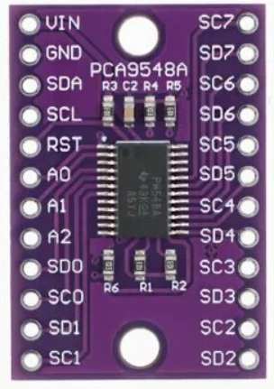

# I²C датчики давления с температурой через PCA9548A

Практическое руководство и реальные ограничения

Документ основан на реальном проекте и длительных тестах с ESP32, PCA9548A и недорогими I²C-датчиками давления со встроенным датчиком температуры.

---

## ⚠️ Перед началом

**Обязательно прочитайте** [описание работы с датчиком при прямом подключении](../direct_connection/README.md) — там описаны основы протокола, калибровка и типичные ошибки.

Этот пример расширяет базовую функциональность для работы с несколькими датчиками через мультиплексор PCA9548A.

---

## 1. Оборудование

- **MCU:** ESP32  
- **I²C мультиплексор:** PCA9548A (адрес по умолчанию `0x70`)  
- **Датчики:** I²C pressure + temperature (адрес `0x78`)  
- **Топология:**  
  - ESP32 → PCA9548A → до 8 независимых I²C веток  
  - В каждой ветке — один датчик давления  



Пример реальной конфигурации:

| Канал PCA | Назначение |
|-----------|------------|
| ch1 | Холодная вода (верх) |
| ch2 | Холодная вода (низ) |
| ch3 | Горячая вода (верх) |
| ch4 | Горячая вода (низ) |

---

## 2. Электрика и физика линии

### 2.1 Подтяжки

- На входе PCA9548A:  
  - SDA/SCL → **10 кОм**  
- На каждой ветке (SCn/SDn):  
  - **4.7 кОм**  
- Между ESP32 и PCA9548A:  
  - Эквивалентная подтяжка около **2.7 кОм** — работает стабильно.

### 2.2 Длина проводов

В проекте использовались линии:
- ESP32 → PCA: ~70 см  
- PCA → датчики: 70–80 см + клеммники на DIN-рейке  

Это **очень длинно для I²C**, поэтому:
- периодически появляются пустые кадры;
- возможны NACK на записи команды измерения.

### 2.3 Что реально помогает

1. Располагать **SCL рядом с GND**, **SDA рядом с GND**.  
2. Использовать **витую пару** (SCL+GND, SDA+GND).  
3. Делать **retry-логику** в коде.  
4. Не полагаться на одиночное чтение.  

Снижение частоты I²C до 5 кГц или 2.5 кГц в нашем случае **существенно ситуацию не изменило** — главную роль играет геометрия проводки.

---

## 3. Протокол датчика

### 3.1 Адреса и команды

- Адрес датчика: `0x78`  
- Команда старта измерения: `0xAC`  
  ```
  [0xAC, 0x00, 0x00]
  ```

**Подробности протокола см. в [описании прямого подключения](../direct_connection/README.md).**

### 3.2 Формат ответа (6 байт)

```
[0] status
[1] rawP[23:16]
[2] rawP[15:8]
[3] rawP[7:0]
[4] rawT[15:8]
[5] rawT[7:0]
```

### 3.3 Статус-байт

По результатам длительных тестов:

- **status = 0x04**  
  → корректный измерительный кадр  
- **status = 0x64**  
  → невалидный кадр  
  - датчик не принял команду  
  - чтение произошло "мимо"  
  - типично сопровождается `00 00 00 00 00`

⚠️ Официальной документации на эти значения нет — это **эмпирически подтверждённое поведение** конкретной партии датчиков.

---

## 4. Алгоритм корректного чтения

### 4.1 Почему нельзя читать «в лоб»

На длинных линиях часто происходит:
- команда измерения не доходит;
- чтение возвращает пустой кадр;
- в логах появляются нули.

Поэтому **обязательно**:

1. Делать `ping` датчика.  
2. Посылать команду измерения.  
3. Ждать не менее **40–50 мс**.  
4. Читать 6 байт.  
5. Проверять, что кадр **не пустой** и `rawP != 0`.  
6. Повторять попытку несколько раз.

### 4.2 Рекомендуемая стратегия

```text
for attempt in 1..N:
    send CMD_MEASURE
    wait 50 ms
    read 6 bytes
    if frame valid:
        use it
        break
```

---

## 5. Работа через PCA9548A

### 5.1 Переключение канала

Перед каждым доступом к датчику:

1. Записать `0x00` в PCA (сброс всех каналов).  
2. Записать `1 << channel`.  
3. Прочитать обратно маску и убедиться, что канал активирован.  
4. Подождать 2–5 мс.  
5. Только после этого работать с датчиком.

### 5.2 Типовая последовательность

```
PCA select channel
delay 5 ms
flush I²C buffer
ping sensor
send measure command
delay 50 ms
read 6 bytes
```

---

## 6. Пересчёт давления

Используется линейная калибровка:

```
PMIN = 0 bar
PMAX = 10 bar
DMIN = 1 677 722   (≈10%)
DMAX = 15 099 494  (≈90%)

P = (rawP - DMIN) * (PMAX - PMIN) / (DMAX - DMIN) + PMIN
```

### Особенности

- При атмосферном давлении `rawP` часто оказывается чуть ниже `DMIN`.  
- В этом случае формула даёт отрицательное значение.  
- В рабочем коде используется:
  ```
  P = max(Pcalc, 0)
  ```

---

## 7. ⚠️ Температура — очень неточная (важно!)

### Формула пересчёта температуры

Датчик возвращает 16-битное значение температуры в байтах 4-5. Формула из документации:

```text
T = (rawT / 65536) * 190 - 40
```

Где:
- `rawT` — 16-битное значение (байты 4-5)
- Диапазон: -40°C до +150°C (190°C диапазон)
- `T` — температура в градусах Цельсия

### ⚠️ Критическое предупреждение

**Температура показывает очень неточно!**

Согласно документации производителя:
- Температура среды должна быть ниже 50°C
- **Производитель рекомендует НЕ использовать значение температуры как реальный термометр**

Практические тесты на четырёх датчиках подтвердили: температура не имеет ничего общего с реальностью.

👉 **Используйте температуру только для отладки, не для реальных измерений!**

---

## 8. Практическое поведение датчиков

В реальном проекте:

| Канал | Условия | Давление |
|-------|----------|----------|
| ch1 | В трубе | ~5.6 bar |
| ch2 | В трубе | ~3.69 bar |
| ch3 | В воздухе | ~0 bar |
| ch4 | В воздухе | ~0 bar |

Для датчиков в воздухе:
- `Pcalc` может быть `-0.02 … -0.03 bar`  
- После clamp получается `0.000 bar` — это нормально.

---

## 9. Политика логирования

### Во время отладки

Полезно логировать:
- `status`
- `raw[]`
- `rawP`
- `rawT`
- количество попыток

### В рабочем режиме

Рекомендуется:
- **логировать только успешные чтения**
- не выводить:
  - пустые кадры
  - `rawP=0`
  - сообщения о неудачных попытках

Пример рабочего лога:
```
cold_top    ch=1 P=5.59bar status=0x04 rawP=9181469 rawT=38610
cold_bottom ch=2 P=3.69bar status=0x04 rawP=6630426 rawT=40013
hot_top     ch=3 P=0.00bar status=0x04 rawP=1641416 rawT=40616
hot_bottom  ch=4 P=0.00bar status=0x04 rawP=1649899 rawT=39265
```

---

## 10. Ограничения, о которых важно знать

1. **I²C не рассчитан на метры кабеля**.  
2. **Клеммники ухудшают форму фронтов**.  
3. **Дешёвые датчики** не имеют чёткой документации по статус-байтам.  
4. **Retry-логика обязательна**.  
5. Для серьёзных систем стоит рассмотреть:
   - I²C-буферы (P82B96, PCA9615)
   - перенос датчиков ближе к контроллеру
   - переход на интерфейс с дифференциальной линией.

---

## 11. Итог

Связка **ESP32 + PCA9548A + I²C датчики давления**:
- полностью рабочая;
- масштабируемая до 8 датчиков;
- устойчивая при правильной обработке ошибок.

Ключевые условия стабильной работы:
- правильные подтяжки;
- аккуратная разводка;
- задержки после переключения канала;
- повторные попытки чтения;
- фильтрация невалидных кадров.

Если соблюдать эти правила — система стабильно работает даже на длинных линиях и в промышленной обвязке.

---

## Использование примера

1. Подключите PCA9548A к ESP32 (SDA=GPIO21, SCL=GPIO22)
2. Подключите датчики давления к каналам PCA9548A (SC0/SD0, SC1/SD1, и т.д.)
3. Загрузите скетч `pressure_i2c_pca9548a_min.ino` в Arduino IDE
4. Откройте Serial Monitor (115200 baud)
5. Вы должны увидеть вывод вида:

```
ESP32 + PCA9548A + I2C pressure sensor (minimal)
PCA9548A: OK (0x70)
ch=0 status=0x04 rawP=9181469 rawT=38610 Pbar=5.590
ch=1 status=0x04 rawP=6630426 rawT=40013 Pbar=3.690
...
```

---

## См. также

- [Прямое подключение датчика к ESP32](../direct_connection/README.md) — основы протокола и калибровка
- [Интеграция с Home Assistant через MQTT](../homeassistant_mqtt/README.md) — полнофункциональный боевой скетч
- [Документация производителя](../../docs/manufacturer/) — оригинальные файлы (содержат мало полезной информации)

